# Purpose of these scripts

## html-only

Creates a basic directory with an examples folder and a src folder for a basic HTML5 site.

## css-to-srcf

Add the appropriate folders and files for a basic project using HTML and css.

## js-to-srcf

Add the appropriate folders and files for a basic project using HTML, css, and js.

# How to use these scripts

#### Pre

1. Create a "Workspaces" directory in a location of your choosing. Keep it somewhere easy to find. Not in **Downloads** or **Desktop**.
2. Use Git to clone this repository to a local path
3. Open terminal and type

`cd <local path you chose>`

Proceed to the _Using_ steps

## _Tricks and Tips_

    1. You may "copy" the path from the "finder" or "file explorer" depending on your OS.
    2. This will allow you to paste to the terminal the path without messing it up

---

    1. You may use Github Desktop to open the project in Visual Studio Code (VSCode)

---

    1. You can further use "tab" to autocomplete the names of folders/files when typing in the terminal. This ensures you only have to type the first three letters.

---

#### Using

1. After navigating in the previous step to your project directory navigate up one directory.

For instance:

if you:

`cd /Users/esteban/Workspaces/setup-scripts` OR `cd setup-scripts` OR `cd workspaces/setup-scripts`

Then you would simply:

`cd ..` to move up one directory to the "workspaces directory"

2. open a terminal and type

`source setup-scripts/html-only.sh`

This will ask for a name for the project and then create a folder called that.

3. Do this 3 times with unique names.

You should have 3 names and folders like so:

---

#### SIMPLE VERSION

4. Run in the terminal

`source setup-scripts/css-to-src.sh`

and input one of the unique names you have.
Then run it again and input one of the other unique names you have.

Two of your folders should now have a "css" folder inside your "src" folder.

One should be only HTML.

5. Run in the terminal

`source setup-scripts/js-to-src.sh`

6. inspect the projects and report on what differences there are.

Take not of which files are there. They are mostly empty but you will fill them out.

Take this document and give it to Google Gemini to summarize and explain why each step works or should work.
